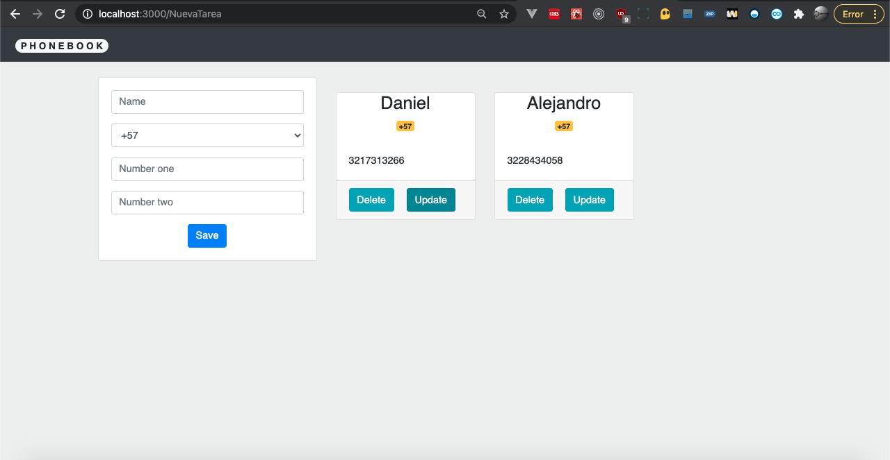

# [Basic PhoneBook with ReactJS](https://github.com/danielm2402/phone-book)

## Features
* [ReactJS]

## Install

Construction and testing of the project requires [node.js](http://nodejs.org/download/). `npm install -g npm@latest`.

Run project:

1. `npm run start`

## Screenshots

